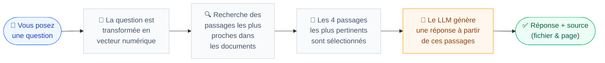
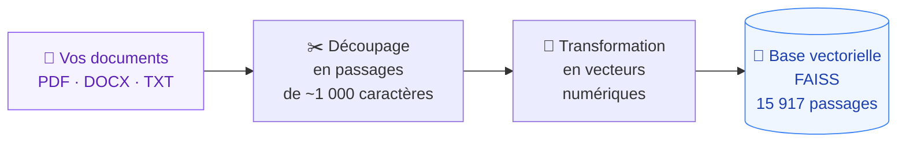
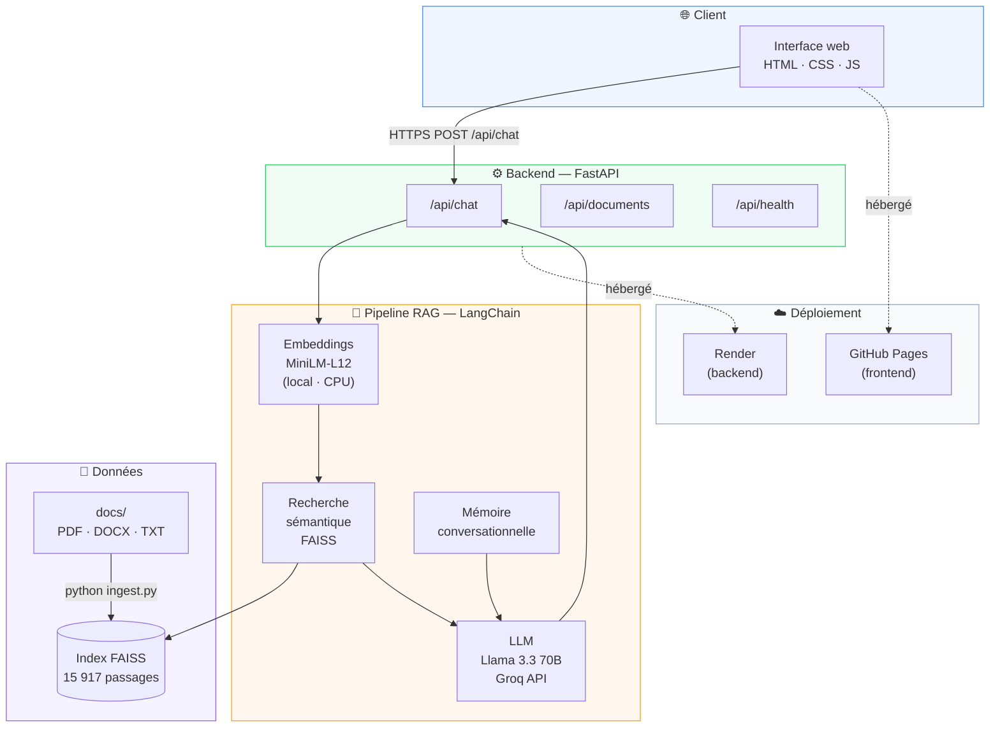

<div align="center">

<h1>📚 DocAssist</h1>
<h3>Un assistant IA qui répond à vos questions<br>en se basant uniquement sur vos documents internes</h3>

<br>

[](https://python.org)
[](https://fastapi.tiangolo.com)
[](https://langchain.com)
[](https://console.groq.com)
[](https://github.com/facebookresearch/faiss)
[](tests/)
[](https://chatbot-rag-xodz.onrender.com)
[](LICENSE)

<br>

### 🚀 [Voir la démo en ligne](https://chatbot-rag-xodz.onrender.com) &nbsp;·&nbsp; 📖 [Tester l'API](https://chatbot-rag-xodz.onrender.com/docs) &nbsp;·&nbsp; 🌐 [Frontend GitHub Pages](https://gomugomuNo01.github.io/Chatbot-RAG/)

</div>

---

## Table des matières

- [Le problème concret](#-le-problème-concret)
- [Comment ça fonctionne](#-comment-ça-fonctionne)
- [Cas d'usage](#-cas-dusage)
- [Compétences démontrées](#-compétences-démontrées)
- [Fonctionnalités](#-fonctionnalités)
- [Architecture technique](#-architecture-technique)
- [Technologies utilisées](#-technologies-utilisées)
- [Structure du projet](#-structure-du-projet)
- [Lancer le projet](#-lancer-le-projet-en-local)
- [Tests](#-tests)

---

## 🎯 Le problème concret

Les collaborateurs perdent du temps à chercher une information dans des dizaines de fichiers PDF, règlements ou contrats. Ils ne savent pas toujours dans quel document chercher — et même quand ils trouvent le bon fichier, ils doivent le parcourir entièrement.

**DocAssist résout ça :** posez votre question en français, obtenez une réponse claire en quelques secondes, avec la source exacte (nom du document + page).

> L'IA ne répond qu'à partir de vos documents. Si l'information n'y est pas, elle le dit — sans inventer.

---

## 💡 Comment ça fonctionne

### En termes simples

Imaginez un assistant qui aurait lu et mémorisé l'intégralité de votre documentation interne. À chaque question, il retrouve instantanément les passages les plus pertinents, formule une réponse claire, et vous indique exactement où il a trouvé l'information.

### Le parcours d'une question



### L'indexation des documents

Avant de pouvoir répondre, l'application lit et indexe les documents une seule fois :



---

## 🏢 Cas d'usage

Une entreprise connecte DocAssist à trois bases documentaires internes :

| Base | Exemples de documents | Question typique |
|---|---|---|
| ⚙️ **Technique** | Guides dev, documentation API, tutoriels framework | *"Comment configurer Spring Boot ?"* |
| 👥 **Ressources Humaines** | Règlement intérieur, politique congés, onboarding | *"Combien de jours de congés ai-je droit ?"* |
| ⚖️ **Juridique** | Contrats types, CGU, Code du travail, Code civil | *"Quelles sont les clauses essentielles d'un CDI ?"* |

---

## 🧑‍💻 Compétences démontrées

Ce projet couvre l'ensemble de la chaîne de développement d'une application IA, du traitement des données jusqu'au déploiement en production.

<details open>
<summary><strong>Intelligence artificielle & NLP</strong></summary>

- Implémentation complète d'une architecture **RAG** *(Retrieval-Augmented Generation)* — technique utilisée par les assistants IA d'entreprise
- Intégration d'un **LLM** (Llama 3.3 70B) via l'API Groq avec **prompt engineering**
- Génération et indexation d'**embeddings vectoriels** multilingues en local (sans API payante)
- Recherche sémantique dans **FAISS** avec seuil de pertinence et déduplication des sources
- Gestion d'un **historique conversationnel** injecté dans le contexte du LLM

</details>

<details open>
<summary><strong>Développement backend</strong></summary>

- **API REST** complète avec FastAPI : 3 endpoints, gestion des erreurs, CORS
- Modèles de données typés avec **Pydantic v2** (validation automatique, sérialisation JSON)
- Architecture en couches : loader → embedder → indexer → retriever → chain
- Parsing multi-formats : **PDF** (PyMuPDF), **Word** (.docx), **texte brut** (.txt)
- Indexation **incrémentale** avec manifeste de hachage — seuls les fichiers modifiés sont retraités

</details>

<details open>
<summary><strong>Développement frontend</strong></summary>

- Interface de chat en **HTML / CSS / JS vanilla** — aucune dépendance externe
- Bulles de messages animées, indicateur de frappe, scroll automatique
- Affichage des sources avec score de pertinence et extrait dépliable
- Design **responsive** (desktop & mobile), sidebar avec filtres par catégorie

</details>

<details open>
<summary><strong>Qualité logicielle</strong></summary>

- **37 tests unitaires** avec pytest — 0 appel réseau (LLM et base de données mockés)
- Fixtures dynamiques (PDF et TXT générés à la volée, pas de fichiers binaires dans les tests)
- Couverture des cas nominaux et limites : fichier vide, format non supporté, question sans résultat

</details>

<details open>
<summary><strong>DevOps & déploiement</strong></summary>

- **Dockerfile** multi-stage avec pré-chargement du modèle d'embeddings
- Déploiement automatisé sur **Render** via `render.yaml` (Infrastructure as Code)
- **CI/CD GitHub Actions** — déploiement continu du frontend sur GitHub Pages à chaque push
- Gestion des secrets via `.env` (jamais commités), `.env.example` pour les collaborateurs

</details>

---

## ✨ Fonctionnalités

| | Fonctionnalité | Description |
|---|---|---|
| 🎯 | **Réponses 100% sourcées** | Nom du fichier + page à chaque réponse, sans exception |
| 🔍 | **Recherche sémantique** | Comprend le sens de la question, pas seulement les mots-clés |
| 📂 | **Multi-formats** | PDF · Word (.docx) · Texte brut (.txt) |
| 🏷️ | **Filtrage par domaine** | Restreindre la recherche à Technique, RH ou Juridique |
| 🧠 | **Mémoire conversationnelle** | L'assistant se souvient des 5 derniers échanges |
| 🤔 | **Honnêteté** | Si l'info n'est pas dans les docs, l'IA le dit explicitement |
| ⚡ | **Indexation intelligente** | L'ajout d'un fichier ne recalcule que ce fichier |
| 💸 | **Coût zéro** | LLM via Groq (free tier) · Embeddings en local (CPU) |

---

## 🏗️ Architecture technique



---

## 🛠️ Technologies utilisées

| Rôle | Outil | Pourquoi ce choix |
|---|---|---|
| 🤖 **Modèle de langage** | Groq + Llama 3.3 70B | Gratuit, très rapide (300 tokens/s), performant en français |
| 🔢 **Vectorisation** | sentence-transformers MiniLM-L12 | Local, gratuit, multilingue FR/EN, léger (120 Mo) |
| 📦 **Base vectorielle** | FAISS (Meta AI) | Standard industriel, recherche ultra-rapide en mémoire |
| 🔗 **Orchestration IA** | LangChain 1.2 | Framework RAG de référence, abstractions robustes |
| ⚡ **Backend** | FastAPI + Pydantic v2 | API moderne, validation automatique, docs Swagger auto-générées |
| 📄 **Parsing PDF** | PyMuPDF | Extraction fidèle texte + métadonnées de page |
| 📝 **Parsing Word** | python-docx | Extraction paragraphe par paragraphe |
| 🎨 **Frontend** | HTML5 / CSS3 / JS vanilla | Zéro dépendance, livrable immédiatement, 100% contrôlé |
| 🧪 **Tests** | pytest | Standard Python, isolation complète via mocks |
| 🐳 **Conteneurisation** | Docker (multi-stage) | Image légère, reproductible en tout environnement |
| 🚀 **Hébergement backend** | Render | Déploiement depuis Git, free tier, zéro infrastructure à gérer |
| 🌐 **Hébergement frontend** | GitHub Pages + Actions | CI/CD intégré, déploiement automatique à chaque push |

---

## 📁 Structure du projet

```
Chatbot-RAG/
│
├── 📂 src/                         ← Pipeline IA — cœur de l'application
│   │
│   ├── loader.py                   ← Lecture & découpage des fichiers en passages
│   │                                  Formats : PDF (PyMuPDF), DOCX, TXT
│   │
│   ├── embedder.py                 ← Transformation du texte en vecteurs numériques
│   │                                  Modèle : MiniLM-L12 (local, CPU, gratuit)
│   │
│   ├── indexer.py                  ← Création et mise à jour de la base FAISS
│   │                                  Inclut un manifeste pour l'indexation incrémentale
│   │
│   ├── retriever.py                ← Recherche des passages les plus pertinents
│   │                                  Retourne les Top-K résultats avec score de confiance
│   │
│   ├── chain.py                    ← Orchestration : question → contexte → LLM → réponse
│   │                                  Gère le cas "je ne sais pas" si aucun doc pertinent
│   │
│   ├── memory.py                   ← Historique conversationnel (5 derniers échanges)
│   │
│   └── utils.py                    ← Fonctions utilitaires : logger, formatage des sources
│
├── 📂 api/                         ← API REST — interface entre frontend et pipeline
│   │
│   ├── main.py                     ← Point d'entrée FastAPI : CORS, routes, frontend statique
│   │
│   ├── schemas.py                  ← Modèles Pydantic : ChatRequest, ChatResponse, SourceResponse
│   │
│   └── routes/
│       ├── chat.py                 ← POST /api/chat — question → réponse + sources
│       ├── documents.py            ← GET  /api/documents — liste des fichiers indexés
│       └── health.py              ← GET  /api/health — statut API et index FAISS
│
├── 📂 frontend/                    ← Interface utilisateur web (vanilla JS)
│   │
│   ├── index.html                  ← Page unique : sidebar + zone de chat + saisie
│   │
│   ├── css/
│   │   └── style.css               ← Design complet : bulles, sources, responsive mobile
│   │
│   └── js/
│       ├── config.js               ← URL API : /api en local, Render en production
│       ├── api.js                  ← Appels HTTP vers le backend (fetch + gestion erreurs)
│       ├── chat.js                 ← Rendu des messages, sources, indicateur de frappe
│       └── app.js                  ← Logique principale : sessions, filtres, événements
│
├── 📂 tests/                       ← Tests automatisés — 37 tests, 0 appel réseau
│   │
│   ├── conftest.py                 ← Fixtures : PDF et TXT générés dynamiquement (PyMuPDF)
│   ├── test_loader.py              ← 16 tests : extraction PDF/TXT, chunking, dispatcher
│   ├── test_retriever.py           ←  9 tests : format_sources, déduplication, cas limites
│   └── test_chain.py              ← 12 tests : mémoire conversationnelle, RAG mocké
│
├── 📂 docs/                        ← Vos documents à indexer (non versionnés)
│   ├── technique/                  ← Guides, documentation API, tutoriels...
│   ├── rh/                         ← Règlement intérieur, politique congés...
│   └── juridique/                  ← Contrats, CGU, Code du travail...
│
├── 📂 data/
│   └── faiss_index/                ← Base vectorielle pré-générée (15 917 passages indexés)
│       ├── index.faiss             ← Vecteurs des documents
│       ├── index.pkl               ← Métadonnées associées
│       └── manifest.json           ← Empreintes des fichiers pour l'indexation incrémentale
│
├── 📂 .github/
│   └── workflows/
│       └── deploy-pages.yml        ← CI/CD : déploie le frontend sur GitHub Pages à chaque push
│
├── ingest.py                       ← CLI d'indexation des documents
│                                      Options : --reset, --categorie, --file
│
├── config.py                       ← Tous les paramètres en un seul endroit
│                                      (modèle LLM, chunk size, seuil de pertinence...)
│
├── Dockerfile                      ← Image Docker multi-stage pour la production
├── render.yaml                     ← Configuration de déploiement Render (IaC)
├── requirements.txt                ← Dépendances Python versionnées
├── pytest.ini                      ← Configuration des tests
└── .env.example                    ← Template de configuration (sans les secrets)
```

---

## 🚀 Lancer le projet en local

<details>
<summary><strong>Voir les instructions d'installation</strong></summary>

**Prérequis :** Python 3.11+ · Clé API Groq gratuite ([console.groq.com](https://console.groq.com))

```bash
# 1. Récupérer le code
git clone https://github.com/GomuGomuNo01/Chatbot-RAG.git
cd Chatbot-RAG

# 2. Créer l'environnement Python
python -m venv .venv
.venv\Scripts\activate        # Windows
# source .venv/bin/activate   # macOS / Linux

# 3. Installer les dépendances
pip install -r requirements.txt

# 4. Configurer la clé API
cp .env.example .env
# Renseigner GROQ_API_KEY dans le fichier .env

# 5. Déposer vos documents dans docs/technique/, docs/rh/, docs/juridique/
#    puis indexer :
python ingest.py

# 6. Démarrer
uvicorn api.main:app --reload --port 8000
```

→ Ouvrir **http://localhost:8000**

**Options d'indexation :**
```bash
python ingest.py                          # Tout indexer (incrémental — ignore les fichiers inchangés)
python ingest.py --reset                  # Reconstruire l'index depuis zéro
python ingest.py --categorie rh           # Une seule catégorie
python ingest.py --file docs/rh/note.pdf  # Un seul fichier
```

</details>

---

## 🧪 Tests

```bash
pytest                                       # Lance les 37 tests
pytest --cov=src --cov-report=term-missing   # Avec rapport de couverture
pytest tests/test_loader.py -v               # Un module en particulier
```

> Les tests tournent **entièrement hors-ligne** : le LLM et la base vectorielle sont simulés (mockés). Aucune clé API requise pour les tests.

---

<div align="center">
  <br>
  <sub>Projet personnel · Développé avec FastAPI · LangChain · Groq · FAISS · sentence-transformers</sub>
  <br><br>
  <a href="https://chatbot-rag-xodz.onrender.com">🚀 Démo live</a> &nbsp;·&nbsp;
  <a href="https://chatbot-rag-xodz.onrender.com/docs">📖 API Swagger</a> &nbsp;·&nbsp;
  <a href="https://gomugomuNo01.github.io/Chatbot-RAG/">🌐 GitHub Pages</a>
</div>
