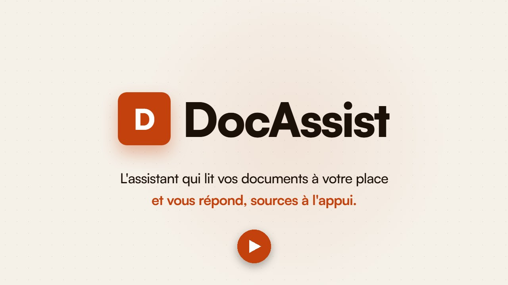
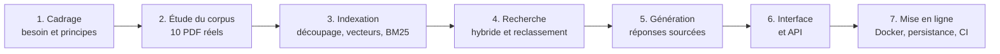
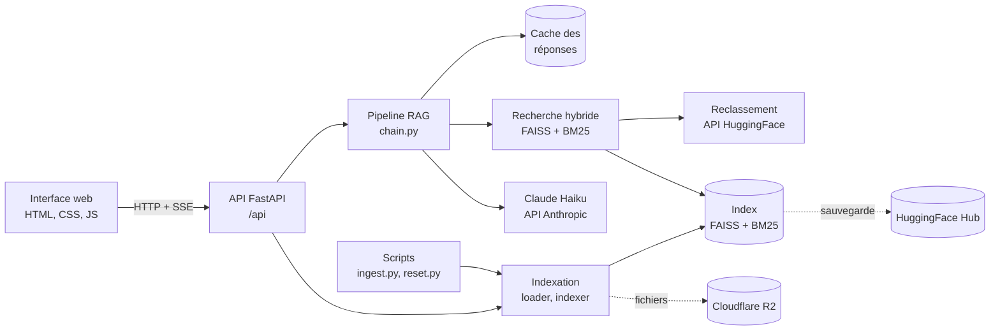

# DocAssist : interroger ses documents et obtenir des réponses sourcées


[](https://github.com/GomuGomuNo01/Chatbot-RAG/actions/workflows/ci.yml?query=branch%3Amain)
[](LICENSE)

Projet de bout en bout : un assistant qui **lit les documents d’une équipe à sa place** et répond
aux questions en citant **le fichier, la page et l’extrait** utilisés. Si la réponse n’est pas
dans les documents, **il le dit au lieu d’inventer**. Conçu à partir de l’analyse d’un corpus
réel de **10 PDF (6 728 pages)** et vérifié par **53 tests automatisés**.

[](https://gomugomuno01-chatbot-rag.hf.space)
[](https://gomugomuno01-chatbot-rag.hf.space/docs)
[](https://gomugomuno01.github.io/Chatbot-RAG/presentation/)

*Présentation : l’application et son fonctionnement en 40 secondes de motion design, sur une
musique originale. Démo : l’application complète, hébergée gratuitement sur HuggingFace Spaces ;
si elle était en veille, elle peut mettre quelques instants à démarrer. API : toutes les routes
documentées et testables depuis le navigateur.*

[](https://gomugomuno01.github.io/Chatbot-RAG/presentation/)

*La présentation vidéo (40 s, 1080p, avec le son) : cliquer sur l’image pour la regarder dans la page « Présentation » publiée sur GitHub Pages. Elle
montre le problème, puis les quatre étapes d’une question (import, question, recherche, réponse
sourcée), le refus d’inventer et les avantages. Elle a été animée image par image avec Remotion ;
sa musique et ses bruitages ont été synthétisés pour elle, calés sur chaque changement de scène,
sans aucun droit à céder.*

> **À savoir** : la démo en ligne est **partagée entre tous les visiteurs**, et les documents qu’on
> y importe sont interrogeables par tous. **N’y importez aucun document confidentiel.** Pour
> répondre, DocAssist envoie la question et les extraits retenus à l’API d’Anthropic (Claude) et,
> si le reclassement est activé, à l’API d’inférence de HuggingFace. Pour des documents sensibles,
> déployez votre propre instance (voir [Reproduire le projet](#14-reproduire-le-projet)).

---

## Sommaire

1. [Le projet en bref](#1-le-projet-en-bref)
2. [Les résultats](#2-les-résultats)
3. [Contexte et objectifs](#3-contexte-et-objectifs)
4. [Problématiques traitées](#4-problématiques-traitées)
5. [Données et confidentialité](#5-données-et-confidentialité)
6. [Outils et technologies](#6-outils-et-technologies)
7. [Méthodologie](#7-méthodologie)
8. [Étapes de réalisation](#8-étapes-de-réalisation)
9. [Découvrir le produit](#9-découvrir-le-produit)
10. [Résultats détaillés](#10-résultats-détaillés)
11. [Conseils d'utilisation](#11-conseils-dutilisation)
12. [Principaux enseignements](#12-principaux-enseignements)
13. [Structure du projet](#13-structure-du-projet)
14. [Reproduire le projet](#14-reproduire-le-projet)
15. [Limites et pistes d'amélioration](#15-limites-et-pistes-damélioration)
16. [Contribuer, sécurité et licence](#16-contribuer-sécurité-et-licence)

---

## 1. Le projet en bref

> **En une phrase :** j’ai conçu et mis en ligne un assistant qui retrouve en quelques secondes une
> information enfouie dans des centaines de pages, et qui montre toujours d’où vient sa réponse.

### La situation

Dans une organisation, l’information est dispersée entre des dizaines de fichiers : contrats,
conventions collectives, guides techniques, procédures. Retrouver une réponse précise prend du
temps, et l’on ne sait pas toujours dans quel document chercher. Les assistants IA généralistes
répondent vite, mais sans dire d’où vient leur réponse, et inventent parfois : sur un sujet
juridique ou technique, une réponse invérifiable ne vaut rien.

### Ce que j’ai fait

| Étape | En pratique |
|---|---|
| **Cadrer le besoin** | Un outil métier, pas un chatbot généraliste : réponses tirées uniquement des documents, sources toujours affichées, refus explicite quand l’information manque |
| **Étudier des documents réels** | Analyse de 10 PDF variés (codes juridiques, documentation technique, convention collective, CV) pour adapter le découpage, la recherche et le format des réponses |
| **Construire le moteur de recherche** | Recherche hybride par le sens (FAISS) et par mots-clés (BM25), fusionnée puis reclassée par pertinence |
| **Générer des réponses fiables** | Claude Haiku encadré par des consignes strictes : extraits uniquement, citations exactes, réponse dans la langue de la question |
| **Maîtriser les coûts** | Cache des questions déjà posées, limite quotidienne de requêtes, modèle économique, calculs d’indexation en local |
| **Rendre l’outil utilisable** | Interface web bilingue (FR/EN), espaces de travail par thème, import par glisser-déposer, réponses affichées au fil de l’eau |
| **Fiabiliser et mettre en ligne** | 53 tests hors ligne, intégration continue, conteneur Docker, démo publique dont les données survivent aux redémarrages |

### Ce que ce projet démontre

- **Sens du besoin** : partir d’une exigence métier (pouvoir vérifier chaque réponse) et en faire
  des règles inscrites dans le code : sources affichées, refus d’inventer.
- **Esprit critique** : remplacer des règles codées en dur pour un domaine (articles de loi,
  termes RH) par une recherche générique, plus robuste face à des documents imprévus.
- **Rigueur** : chaque service externe a une solution de repli (reclassement indisponible, index
  absent, indexation interrompue), et les composants clés sont couverts par des tests.
- **Technique** : chaîne RAG complète (découpage, vectorisation, recherche hybride, reclassement,
  génération), API REST avec réponses en flux, interface web, Docker, intégration continue.
- **Maîtrise des coûts** : un hébergement entièrement gratuit (HuggingFace Spaces, Cloudflare R2,
  HuggingFace Hub) et environ 0,006 $ par question.
- **Autonomie** : projet mené du cadrage à la mise en ligne, en plus de 170 commits, avec des
  versions documentées dans le [CHANGELOG](CHANGELOG.md).

### Pour découvrir le travail en 2 minutes

1. Essayer la [démo en ligne](https://gomugomuno01-chatbot-rag.hf.space) : poser une question,
   puis regarder les sources affichées sous la réponse.
2. Lire [les résultats](#2-les-résultats) juste en dessous.
3. Suivre [le parcours d’une question](#82-le-parcours-dune-question), étape par étape.

## 2. Les résultats

**Chaque réponse est vérifiable.** Sous chaque réponse, DocAssist affiche ses sources : nom du
fichier, page, extrait et score de pertinence. Les fichiers cités dans la réponse passent en
premier : on contrôle l’information en quelques secondes.

**L’assistant n’invente pas.** Il répond uniquement à partir des extraits retrouvés. Si aucun ne
contient l’information, il le dit et propose de reformuler, au lieu de compléter avec des
connaissances extérieures. Dans ce cas, aucune source n’est affichée, pour ne pas laisser croire
le contraire.

**La recherche ne rate pas les termes exacts.** Un numéro d’article (L1234-5), un acronyme (PHP,
SQL) ou une référence sont retrouvés mot pour mot par la recherche par mots-clés, là où une
recherche par le sens seule les manquerait.

**Le coût reste sous contrôle.** Environ 0,006 $ par question avec Claude Haiku. Une question déjà
posée est servie depuis le cache, sans appel à l’IA, et une limite quotidienne plafonne la dépense
(10 questions par jour sur la démo publique).

**Rien ne se perd au redémarrage.** Les documents sont sauvegardés sur Cloudflare R2 et l’index de
recherche sur HuggingFace Hub, puis restaurés automatiquement au démarrage du serveur.

**N’importe qui peut l’essayer.** Une démo publique, sans installation ni compte, et une API
documentée, testable depuis le navigateur.

Le détail se trouve dans les sections [Résultats détaillés](#10-résultats-détaillés) et
[Étapes de réalisation](#8-étapes-de-réalisation).

## 3. Contexte et objectifs

**Le problème.** Une équipe (RH, juridique, technique) doit retrouver vite une information
précise dans sa documentation : un délai, une procédure, un article, une option de configuration.
La recherche classique par mot-clé ne comprend pas les questions ; un assistant IA généraliste ne
connaît pas les documents internes et ne cite pas ses sources.

**Les objectifs** fixés au cadrage :

- **répondre vite et juste** : une question en langage naturel, une réponse synthétique en
  quelques secondes ;
- **prouver chaque réponse** : fichier, page et extrait affichés systématiquement ;
- **ne jamais inventer** : dire clairement quand l’information n’est pas dans les documents ;
- **s’adapter à tout type de document** : juridique, technique, RH ou CV, sans règle propre à un
  domaine ;
- **rester économique** : hébergement gratuit, coût par question minimal, dépense plafonnée ;
- **être simple à utiliser** : interface bilingue, espaces par thème, import par glisser-déposer.

Le positionnement du produit (public visé, ton, principes) est décrit dans
[PRODUCT.md](PRODUCT.md).

## 4. Problématiques traitées

| # | Question | Réponse apportée |
|---|---|---|
| 1 | Comment retrouver la bonne information parmi des milliers de pages ? | Documents découpés en passages d’environ 900 caractères, indexés deux fois : par le sens (FAISS) et par mots-clés (BM25) |
| 2 | Comment ne pas rater un terme exact (article, acronyme, référence) ? | Recherche par mots-clés avec racinisation française et anglaise, renforcée quand la question contient un acronyme ou une référence |
| 3 | Comment ne garder que les passages vraiment utiles ? | Fusion des deux classements, puis reclassement des 12 meilleurs candidats par un modèle spécialisé ; les 6 premiers sont transmis à l’IA |
| 4 | Comment empêcher l’IA d’inventer ? | Consigne stricte : répondre uniquement à partir des extraits, sinon le dire. Sans passage pertinent, un message de repli est renvoyé sans faire rédiger l’IA |
| 5 | Comment comprendre une question de suivi (« et pour les cadres ? ») ? | Prise en compte des 4 derniers échanges, et réécriture de la question quand elle est très courte ou contient un pronom |
| 6 | Comment limiter les coûts ? | Cache des réponses (7 jours), limite quotidienne, Claude Haiku, vectorisation calculée localement |
| 7 | Comment survivre aux redémarrages d’un hébergement gratuit ? | Documents sur Cloudflare R2, index sur HuggingFace Hub, restauration automatique au démarrage |
| 8 | Comment séparer les sujets ? | Espaces de travail libres (RH, juridique, technique…) ; la recherche peut être limitée à un seul espace |

**Garantie centrale : chaque réponse s’appuie sur des extraits identifiés, affichés avec elle.**

## 5. Données et confidentialité

| Élément | Détail |
|---|---|
| Documents acceptés | PDF contenant du texte (500 pages indexées au plus), Word (.docx), texte (.txt), Markdown (.md) ; 50 Mo maximum par fichier |
| Stockage | En local : `docs/<espace>/` et `data/`. En ligne : fichiers sur Cloudflare R2, index sur un dépôt privé HuggingFace Hub |
| Indexation | Extraction, découpage et vectorisation tournent sur le serveur de l’application : l’indexation ne passe par aucune API externe |
| Envoyé à Anthropic | À chaque question non servie par le cache : la question, l’historique récent de la conversation et les 6 extraits retenus |
| Envoyé à HuggingFace | Si le reclassement est activé : la question et les passages candidats, pour les classer |
| Conversations | Gardées en mémoire vive, par session ; elles disparaissent au redémarrage du serveur |
| Effacement | Suppression d’un document ou d’un espace depuis l’interface ; `python reset.py` efface tout (local, R2 et HuggingFace Hub), après confirmation |

## 6. Outils et technologies

| Outil | Utilisation dans le projet | Pourquoi ce choix |
|---|---|---|
| **Claude Haiku 4.5** (Anthropic) | Rédaction des réponses, réécriture des questions de suivi | Très bon en français, suit les consignes avec rigueur, environ 0,006 $ par question |
| **LangChain** | Enchaînement de la recherche et de la génération | Briques standard pour les documents, l’index et l’appel au modèle |
| **fastembed** (ONNX), `BAAI/bge-small-en-v1.5` | Vectorisation des passages et des questions | Modèle de 37 Mo, rapide sur processeur, sans PyTorch ni GPU |
| **FAISS** | Recherche par le sens | Standard de la recherche vectorielle, très rapide, filtrage par espace |
| **BM25 Okapi** (implémentation maison), NLTK Snowball | Recherche par mots-clés | Racinisation FR/EN et paires de mots ; retrouve les termes exacts que la recherche vectorielle manque |
| **BGE reranker** (API HuggingFace) | Reclassement des candidats | Plus précis qu’une simple similarité, sans charger de modèle dans la mémoire du serveur |
| **FastAPI**, Pydantic v2 | API REST, réponses en flux (Server-Sent Events) | Validation typée, documentation Swagger générée automatiquement |
| **PyMuPDF**, python-docx | Extraction du texte | PDF avec accents corrects, documents Word natifs |
| **HTML, CSS et JavaScript natifs** | Interface web bilingue | Aucune dépendance ni étape de compilation ; servie par FastAPI à la même adresse que l’API |
| **Cloudflare R2**, **HuggingFace Hub** | Sauvegarde des documents et de l’index | Gratuits, indépendants du disque éphémère de l’hébergement |
| **Docker**, **HuggingFace Spaces** | Conteneur et hébergement | Image en deux étapes, modèle d’embedding pré-téléchargé ; 16 Go de RAM gratuits |
| **pytest, Ruff, pip-audit, Dependabot** | Qualité | Tests hors ligne, lint et format, audit des dépendances, mises à jour automatiques |
| **GitHub Actions** | Intégration continue | Tests sur Python 3.11 et 3.12, lint et audit à chaque envoi |

## 7. Méthodologie


```mermaid
flowchart LR
    A[1. Cadrage<br/>besoin et principes] --> B[2. Étude du corpus<br/>10 PDF réels]
    B --> C[3. Indexation<br/>découpage, vecteurs, BM25]
    C --> D[4. Recherche<br/>hybride et reclassement]
    D --> E[5. Génération<br/>réponses sourcées]
    E --> F[6. Interface<br/>et API]
    F --> G[7. Mise en ligne<br/>Docker, persistance, CI]
```

Trois principes ont guidé le travail :

1. **Les sources avant la réponse** : une réponse sans source est suspecte. Les citations sont au
   cœur de l’interface, pas un détail.
2. **La précision avant la fluidité** : mieux vaut dire « je ne trouve pas » qu’inventer. Le ton
   ne compense jamais une approximation.
3. **Le générique plutôt que le spécifique** : la version 2 a retiré les catégories figées et les
   règles propres au droit ou aux RH, au profit d’espaces libres et d’une recherche hybride
   valable pour tout document.

## 8. Étapes de réalisation

### 8.1 Architecture


```mermaid
flowchart LR
    UI[Interface web<br/>HTML, CSS, JS] -- HTTP + SSE --> API[API FastAPI<br/>/api]
    API --> RAG[Pipeline RAG<br/>chain.py]
    API --> IDX[Indexation<br/>loader, indexer]
    CLI[Scripts<br/>ingest.py, reset.py] --> IDX
    RAG --> CACHE[(Cache des<br/>réponses)]
    RAG --> RET[Recherche hybride<br/>FAISS + BM25]
    RET --> RR[Reclassement<br/>API HuggingFace]
    RAG --> LLM[Claude Haiku<br/>API Anthropic]
    IDX --> IX[(Index<br/>FAISS + BM25)]
    RET --> IX
    IDX -. fichiers .-> R2[(Cloudflare R2)]
    IX -. sauvegarde .-> HF[(HuggingFace Hub)]
```

FastAPI sert à la fois l’interface (`/`) et l’API (`/api`) à la même adresse : l’interface n’a
aucune URL à configurer, quelle que soit la plateforme. Les scripts en ligne de commande passent
par les mêmes modules que l’API.

### 8.2 Le parcours d'une question

| Étape | Rôle | Décisions techniques |
|---|---|---|
| 0. Langue | Détecter la langue de la question | La réponse suit la langue de la question (français ou anglais) |
| 1. Cache | Chercher une question déjà posée dans le même espace | Similarité d’au moins 0,92 **et** assez de mots en commun ; réponse servie sans appel à l’IA, valable 7 jours |
| 2. Enrichissement | Préparer jusqu’à 3 requêtes de recherche | Acronymes développés (PHP, SQL…), comparaison « X vs Y » décomposée, question de suivi réécrite avec l’historique |
| 3. Recherche | Trouver les candidats | 20 passages par moteur (FAISS et BM25) et par requête, filtrés par espace si demandé |
| 4. Fusion | Combiner les deux classements | Reciprocal Rank Fusion pondérée ; le poids des mots-clés monte pour un acronyme ou une référence et baisse pour une question conceptuelle |
| 5. Reclassement | Garder les meilleurs | Les 12 premiers reclassés par BGE reranker, 6 conservés ; repli sur l’ordre fusionné si le service ne répond pas |
| 6. Génération | Rédiger la réponse | Claude Haiku, température 0,1 ; consignes strictes : extraits uniquement, citations exactes, format adapté (liste, tableau, bloc de code) |
| 7. Sources | Montrer d’où vient la réponse | Jusqu’à 3 sources, en priorité les fichiers cités dans la réponse ; aucune si l’IA indique que l’information est absente |
| 8. Mémoire | Garder le fil | Échange ajouté à l’historique de la session ; réponse mise en cache |

### 8.3 L'indexation d'un document

| Étape | Rôle | Décisions techniques |
|---|---|---|
| Import | Glisser-déposer dans un espace | Format et taille (50 Mo) contrôlés ; indexation en arrière-plan, une seule à la fois |
| Extraction | Lire le texte page par page | PyMuPDF pour les PDF, python-docx pour Word ; au-delà de 500 pages, PDF tronqué avec avertissement ; PDF scanné signalé |
| Découpage | Couper en passages | Environ 900 caractères avec 220 de chevauchement ; coupe en priorité aux titres, puis aux paragraphes, puis aux phrases ; passages de moins de 80 caractères écartés |
| Indexation | Construire les deux index | FAISS et BM25 reconstruits ensemble, pour rester synchronisés |
| Suivi | Ne retraiter que le nécessaire | Empreinte MD5 de chaque fichier : l’indexation incrémentale ne traite que les fichiers nouveaux ou modifiés ; réindexation automatique si les réglages de découpage changent |
| Sauvegarde | Survivre aux redémarrages | Fichier envoyé sur R2, index poussé sur HuggingFace Hub |
| Reprise | Détecter une indexation interrompue | Verrou posé pendant l’indexation ; s’il subsiste au démarrage, l’interruption est signalée |

### 8.4 Fiabilité et robustesse

| Sujet | Garantie | Preuve |
|---|---|---|
| Aucun passage trouvé | Message de repli explicite, avec des pistes de reformulation | Test `test_no_docs_returns_fallback_message` |
| Sources | Fichier, page, extrait et score toujours renvoyés ; doublons fusionnés | Tests `TestFormatSources` (10 tests) |
| Recherche par mots-clés | Termes retrouvés, filtre par espace respecté | Tests `TestBM25` |
| Fusion | Un passage trouvé par les deux moteurs remonte | Test `test_fusion_boosts_documents_in_multiple_lists` |
| Mémoire | Nombre d’échanges plafonné, plus anciens évincés, effacement possible | Tests `TestConversationMemory` (8 tests) |
| Extraction | Pages numérotées à partir de 1, formats non pris en charge refusés | Tests de [`test_loader.py`](tests/test_loader.py) (22 tests) |
| Espaces | Identifiants validés, noms réservés refusés | Tests `TestWorkspacesConfig` |
| Reclassement indisponible | Repli sur l’ordre fusionné, sans erreur | Code de [`reranker.py`](src/reranker.py) |
| Redémarrage | Documents, index et compteur restaurés ; un échec de restauration ne bloque pas le démarrage | Code de [`api/main.py`](api/main.py) |
| Indexation concurrente | Une seule à la fois ; une seconde demande est refusée (409) | Code de [`documents.py`](api/routes/documents.py) |
| Erreurs | Message clair avec un code de référence, détail dans les journaux | Code de [`api/main.py`](api/main.py) |
| Dépendances | Audit à chaque envoi, mises à jour proposées automatiquement | `pip-audit`, Dependabot |

### 8.5 Tests et validation

| Niveau | Cible | Outil | Résultat |
|---|---|---|---|
| Unitaires | Extraction et découpage (PDF, TXT), choix de l’extracteur selon le format | pytest | 22 tests passés |
| Unitaires | Recherche : mise en forme des sources, BM25, fusion RRF | pytest | 16 tests passés |
| Intégration | Pipeline RAG (IA et index simulés), mémoire, espaces | pytest | 15 tests passés |
| Continu | Tests, lint, format, audit des dépendances | GitHub Actions | Python 3.11 et 3.12 |
| Étude du corpus | Extraction sur 10 PDF réels (6 728 pages) | PyMuPDF | [`analysis_results.json`](analysis_results.json) |

Les tests tournent **entièrement hors ligne** : le modèle d’IA et l’index sont simulés, aucune clé
API n’est nécessaire.

### 8.6 Mise à disposition

| Mode | Pour qui | Fonctionnement |
|---|---|---|
| [Démo en ligne](https://gomugomuno01-chatbot-rag.hf.space) | Visiteurs, recruteurs | L’application complète sur HuggingFace Spaces (Docker, processeur gratuit) ; documents sur R2, index sur HuggingFace Hub, 10 questions par jour |
| [API Swagger](https://gomugomuno01-chatbot-rag.hf.space/docs) | Développeurs | Toutes les routes documentées et testables depuis le navigateur |
| [Installation locale](#14-reproduire-le-projet) | Usage privé | Fonctionne sans R2 ni HuggingFace Hub : documents et index restent sur la machine |

## 9. Découvrir le produit

▶ **[Essayer la démo en ligne](https://gomugomuno01-chatbot-rag.hf.space)**,
🎬 **[voir la présentation vidéo](https://gomugomuno01.github.io/Chatbot-RAG/presentation/)** (40 s), ou
📖 **[explorer l’API](https://gomugomuno01-chatbot-rag.hf.space/docs)**.

| Zone de l’interface | Ce qu’on y fait |
|---|---|
| **Espaces de travail** (barre latérale) | Créer un espace par thème (nom, couleur, emoji), voir ses documents, limiter la recherche à un espace |
| **Import** | Glisser-déposer des fichiers, choisir l’espace, suivre la progression de l’indexation |
| **Conversation** | Poser une question, lire la réponse qui s’affiche au fil de l’eau, enchaîner les questions de suivi |
| **Sources** | Sous chaque réponse : fichier, page, extrait et score de pertinence |
| **Compteur** | Questions restantes pour la journée, et message clair quand la limite est atteinte |
| **Langue et écrans** | Interface en français ou en anglais, utilisable sur ordinateur, tablette et mobile |

**Exemples de questions** selon les documents importés :

- « Quel est le délai de préavis prévu par la convention collective ? »
- « Que dit l’article L1234-5 du Code du travail ? »
- « Quelle est la différence entre `@Component` et `@Bean` dans Spring Boot ? »

## 10. Résultats détaillés

### Le corpus étudié

Pour concevoir le découpage, la recherche et les consignes données à l’IA, j’ai analysé
l’extraction de 10 PDF réels et hétérogènes ([`analysis_results.json`](analysis_results.json)) :

| Famille | Documents | Pages | Ce que cela a imposé |
|---|---|---|---|
| Juridique | Code du travail, Code civil, Code pénal, Constitution de 1958, Déclaration des droits de l’homme | 4 639 | Numéros d’articles retrouvés exactement (recherche par mots-clés) et cités tels quels |
| RH | Convention collective | 16 | Grilles et barèmes restitués sous forme de tableau |
| Technique | Documentation PHP, référence Spring Boot, cours JavaScript | 2 072 | Code rendu dans des blocs avec le bon langage, versions signalées |
| Profil | CV | 1 | Informations reproduites telles quelles, sans interprétation |
| **Total** | **10 documents** | **6 728** | |

Ce corpus a aussi révélé une limite : les très gros PDF (le Code du travail compte 3 489 pages)
dépassent la mémoire d’un hébergement gratuit. Seules les 500 premières pages sont alors indexées,
et l’interface l’indique.

### Robustesse

Chaque situation ci-dessous est prise en charge sans plantage, avec un message clair :

- service de reclassement indisponible : l’ordre de la fusion est conservé ;
- index absent au démarrage alors que des documents existent : réindexation automatique en
  arrière-plan ;
- réglages de découpage ou modèle d’embedding modifiés : réindexation automatique ;
- indexation interrompue (manque de mémoire, redémarrage) : interruption signalée au démarrage ;
- PDF scanné sans texte : signalé, une étape d’OCR étant nécessaire ;
- limite quotidienne atteinte : message explicite indiquant quand revenir ;
- espace, fichier ou format invalide : erreur explicite (404, 409 ou 422).

### Qualité du code

- **53 tests automatisés**, hors ligne et sans clé API : 22 sur l’extraction, 16 sur la
  recherche, 15 sur le pipeline et la mémoire.
- Lint et format vérifiés par **Ruff** à chaque envoi.
- **Audit des dépendances** (pip-audit) et mises à jour proposées par **Dependabot**.
- Image Docker en deux étapes, modèle d’embedding pré-téléchargé, contrôle de santé intégré
  (`/api/health`).

## 11. Conseils d'utilisation

| Priorité | Conseil | Pourquoi |
|---|---|---|
| 1 | **Ne rien importer de confidentiel sur la démo publique** | Elle est partagée entre tous les visiteurs ; pour des documents sensibles, déployer sa propre instance |
| 2 | **Ranger les documents par espace** (RH, juridique, technique…) | La recherche peut être limitée à un espace : moins de bruit, des réponses plus justes |
| 3 | **Poser des questions précises**, avec les termes du document | Un numéro d’article, un nom de procédure ou un acronyme sont retrouvés mot pour mot |
| 4 | **Lire les sources** affichées sous la réponse | C’est la garantie de l’outil : chaque affirmation se vérifie en quelques secondes |
| 5 | **Importer des PDF contenant du texte** | Les PDF scannés (images) ne sont pas lus sans OCR ; découper les documents de plus de 500 pages |
| 6 | **Activer le reclassement** (`HF_TOKEN`, `RERANKER_ENABLED=true`) | Il affine l’ordre des passages transmis à l’IA |
| 7 | **Garder une limite quotidienne** (`DAILY_REQUEST_LIMIT`) | Elle plafonne la dépense, surtout sur une instance publique |

## 12. Principaux enseignements

**Sur la recherche d’information**
- **La recherche par le sens ne suffit pas.** Elle comprend les reformulations, mais rate les
  termes exacts (numéros d’articles, acronymes). La combiner à une recherche par mots-clés, puis
  reclasser, donne le meilleur des deux.
- **Le générique l’emporte sur le spécifique.** Une première version contenait des règles propres
  au droit et aux RH ; les retirer au profit d’une recherche hybride a rendu l’outil valable pour
  tout document, et plus simple à maintenir.

**Sur la fiabilité d’une IA**
- **La confiance vient des sources, pas du ton.** Afficher le fichier, la page et l’extrait change
  le rapport à la réponse : on la vérifie au lieu de la croire.
- **Un cache doit rester prudent.** Deux questions proches par le sens peuvent appeler des
  réponses différentes ; le cache exige donc aussi des mots en commun avant de resservir une
  réponse.

**Sur l’hébergement gratuit**
- **Un disque éphémère impose une persistance externe** : documents sur R2, index sur
  HuggingFace Hub, restaurés au démarrage.
- **La mémoire est la vraie limite** : modèle d’embedding ONNX de 37 Mo plutôt que PyTorch,
  reclassement délégué à une API, verrou pour détecter une indexation interrompue, plafond de 500
  pages par PDF.
- **Servir l’interface et l’API à la même adresse** évite toute configuration d’URL, quelle que
  soit la plateforme : le même frontend fonctionne en local, sur Render comme sur HuggingFace
  Spaces.

## 13. Structure du projet

```
Chatbot-RAG/
├── README.md, CHANGELOG.md, PRODUCT.md
├── LICENSE, CONTRIBUTING.md, SECURITY.md
├── src/                      Pipeline IA
│   ├── loader.py             Extraction et découpage (PDF, DOCX, TXT, MD)
│   ├── embedder.py           Vectorisation (fastembed, ONNX)
│   ├── indexer.py            Index FAISS et BM25 jumeaux, suivi des fichiers
│   ├── bm25_store.py         Recherche par mots-clés (BM25 Okapi)
│   ├── retriever.py          Recherche hybride, fusion RRF, reclassement
│   ├── reranker.py           Reclassement BGE via l’API HuggingFace
│   ├── query_processor.py    Acronymes, questions comparatives, réécriture
│   ├── chain.py              Question → passages → réponse de Claude
│   ├── cache.py              Cache des réponses déjà données
│   ├── memory.py             Historique de conversation
│   ├── rate_limiter.py       Limite quotidienne de requêtes
│   ├── storage.py            Sauvegarde des fichiers sur Cloudflare R2
│   ├── hf_store.py           Sauvegarde de l’index sur HuggingFace Hub
│   └── utils.py              Fonctions partagées
├── api/                      API REST (FastAPI)
│   ├── main.py               Démarrage, restauration des données, gestion des erreurs
│   ├── schemas.py            Formats des requêtes et des réponses
│   └── routes/               chat.py, documents.py, health.py
├── frontend/                 Interface web bilingue (HTML, CSS, JavaScript)
├── assets/video/             Présentation vidéo (MP4), son aperçu et sa page web (GitHub Pages)
├── tests/                    Tests hors ligne (pytest)
├── ingest.py                 Indexation en ligne de commande
├── reset.py                  Remise à zéro complète (local, R2, HuggingFace Hub)
├── config.py                 Tous les réglages, centralisés
├── Dockerfile                Image de production (port 7860)
├── requirements.txt          Dépendances de développement
├── requirements-prod.txt     Dépendances de production (image allégée)
└── .github/                  Intégration continue, Dependabot, modèles d’issues et de PR
```

## 14. Reproduire le projet

**Option 1 : la démo en ligne (pour découvrir)**

Ouvrir la [démo](https://gomugomuno01-chatbot-rag.hf.space), choisir un espace dans la barre
latérale (ou en créer un et y importer un document), puis poser une question.

**Option 2 : en local (pour un usage privé)**

Prérequis : Python 3.11 ou plus, et une [clé API Anthropic](https://console.anthropic.com).

```bash
git clone https://github.com/GomuGomuNo01/Chatbot-RAG.git
cd Chatbot-RAG
python -m venv .venv
.venv\Scripts\activate          # Windows ; sous macOS ou Linux : source .venv/bin/activate
pip install -r requirements.txt
cp .env.example .env            # puis renseigner ANTHROPIC_API_KEY
uvicorn api.main:app --port 7860 --reload   # interface sur http://localhost:7860
```

Pour tout garder sur votre machine, laissez vides les variables `R2_*` et `HF_REPO_ID` dans
`.env` : les valeurs d’exemple activeraient sinon une sauvegarde en ligne vouée à l’échec. Les
documents restent alors dans `docs/<espace>/` et l’index dans `data/faiss_index/`.

> **Sous Windows** : ajoutez `HF_HUB_DISABLE_SYMLINKS_WARNING=1` dans `.env` pour masquer un
> avertissement sans conséquence de HuggingFace.

**Option 3 : sur HuggingFace Spaces (pour une démo publique)**

<details>
<summary><b>Guide de déploiement</b></summary>

1. **Créer le Space** sur [huggingface.co/new-space](https://huggingface.co/new-space) :
   SDK **Docker**, modèle **Blank**, matériel **CPU Basic (gratuit)**.
2. **Créer le dépôt de l’index** sur [huggingface.co/new](https://huggingface.co/new) : type
   **Dataset**, nom `chatbot-rag-index`, visibilité **Privée**.
3. **Pousser le code** sur une branche sans historique et sans le dossier `assets/` :
   HuggingFace refuse les fichiers binaires volumineux (comme la vidéo) envoyés sans Git LFS,
   et le Space n’en a pas besoin.

   ```bash
   git remote add hf https://huggingface.co/spaces/VOTRE_USERNAME/chatbot-rag
   git checkout --orphan hf-deploy
   git add -A
   git rm -r --cached --quiet assets
   git commit -m "deploy"
   git push hf hf-deploy:main --force
   git checkout main && git branch -D hf-deploy
   ```

4. **Configurer les secrets** (Settings → Variables and secrets) :

   | Variable | Type | Valeur |
   |---|---|---|
   | `ANTHROPIC_API_KEY` | 🔒 Secret | Votre clé Anthropic |
   | `HF_TOKEN` | 🔒 Secret | Jeton HuggingFace (droits d’écriture) |
   | `HF_REPO_ID` | Variable | `username/chatbot-rag-index` |
   | `R2_ACCOUNT_ID` | 🔒 Secret | Identifiant du compte Cloudflare |
   | `R2_ACCESS_KEY_ID` | 🔒 Secret | Clé d’accès R2 |
   | `R2_SECRET_ACCESS_KEY` | 🔒 Secret | Clé secrète R2 |
   | `R2_BUCKET_NAME` | Variable | Nom du bucket |
   | `ANTHROPIC_MODEL` | Variable | `claude-haiku-4-5-20251001` |
   | `DAILY_REQUEST_LIMIT` | Variable | `10` par exemple (`0` = illimité) |
   | `RERANKER_ENABLED` | Variable | `true` |

Le Space se construit automatiquement (5 à 10 minutes la première fois).

</details>

<details>
<summary><b>Scripts en ligne de commande</b></summary>

| Commande | Rôle |
|---|---|
| `python ingest.py` | Indexe les fichiers nouveaux ou modifiés de `docs/` |
| `python ingest.py --reset` | Reconstruit tout l’index |
| `python ingest.py --workspace rh` | Indexe un seul espace |
| `python ingest.py --file docs/rh/note.pdf` | Indexe un seul fichier |
| `python reset.py` | Efface tout (données locales, fichiers R2, index HuggingFace Hub), après confirmation |

</details>

<details>
<summary><b>Configuration (fichier <code>.env</code>, voir <code>.env.example</code>)</b></summary>

| Variable | Défaut | Rôle |
|---|---|---|
| `ANTHROPIC_API_KEY` | aucun (obligatoire) | Clé de l’API Anthropic |
| `ANTHROPIC_MODEL` | `claude-haiku-4-5-20251001` | Modèle qui rédige les réponses ; `claude-sonnet-4-6` pour plus de qualité, à un coût plus élevé |
| `DAILY_REQUEST_LIMIT` | `0` (illimité) | Questions traitées par l’IA par jour |
| `RATE_LIMIT_EXCLUDE_CACHE` | `true` | Les réponses servies par le cache ne sont pas comptées |
| `RERANKER_ENABLED` | `false` | Active le reclassement (nécessite `HF_TOKEN`) |
| `HF_TOKEN`, `HF_REPO_ID` | vides | Reclassement, et sauvegarde de l’index sur HuggingFace Hub |
| `R2_ACCOUNT_ID`, `R2_ACCESS_KEY_ID`, `R2_SECRET_ACCESS_KEY`, `R2_BUCKET_NAME` | vides | Sauvegarde des documents sur Cloudflare R2 |
| `PORT` | `7860` | Port de l’API |

Réglages du moteur, modifiables dans [`config.py`](config.py) :

| Réglage | Valeur | Rôle |
|---|---|---|
| `CHUNK_SIZE`, `CHUNK_OVERLAP` | `900`, `220` | Taille des passages et chevauchement, en caractères |
| `TOP_K_RETRIEVAL` | `20` | Candidats par moteur de recherche |
| `RERANK_TOP_N`, `TOP_K_RESULTS` | `12`, `6` | Candidats reclassés, puis passages transmis à l’IA |
| `HYBRID_BM25_WEIGHT` | `0.45` | Poids par défaut des mots-clés dans la fusion |
| `RESPONSE_CACHE_TTL_SECONDS` | `604800` | Durée de vie du cache (7 jours) |
| `MEMORY_MAX_EXCHANGES` | `4` | Échanges pris en compte dans une conversation |

Changer les réglages de découpage ou le modèle d’embedding déclenche une réindexation
automatique au démarrage suivant.

</details>

**Vérifier :**

```bash
pytest                                        # 53 tests, hors ligne
pytest --cov=src --cov-report=term-missing    # avec la couverture de code
ruff check . && ruff format --check .
pip-audit -r requirements.txt
```

## 15. Limites et pistes d'amélioration

**Limites**
- **Pas de comptes utilisateurs** : une instance est partagée par tous ceux qui y ont accès ; la
  démo publique ne convient donc pas à des documents confidentiels.
- **PDF scannés** : sans couche de texte, ils ne sont pas lus (pas d’OCR).
- **Très gros documents** : au-delà de 500 pages, un PDF est tronqué, pour tenir dans la mémoire
  d’un hébergement gratuit.
- **Modèle d’embedding anglophone** : `bge-small-en-v1.5` est surtout entraîné sur l’anglais ; la
  recherche par mots-clés, avec racinisation française, le complète sur les textes en français.
- **Conversations éphémères** : l’historique est gardé en mémoire vive et disparaît au
  redémarrage.
- **Reconstruction complète de l’index** à chaque suppression de document : rapide sur quelques
  fichiers, plus longue sur un gros corpus.
- **Services externes** : Anthropic pour les réponses, HuggingFace pour le reclassement (avec
  repli), R2 et HuggingFace Hub pour la persistance.
- **Couverture des tests** : extraction, recherche et pipeline sont testés ; les routes de l’API
  ne le sont pas encore.

**Pistes d’amélioration**
- Ajouter une authentification et des espaces privés par utilisateur.
- Lire les PDF scannés grâce à l’OCR.
- Indexer les très gros documents par morceaux, pour lever la limite de 500 pages.
- Mesurer la qualité des réponses sur un jeu de questions de référence (justesse des sources,
  refus justifiés).
- Essayer un modèle d’embedding multilingue.
- Conserver l’historique des conversations d’une session à l’autre.
- Tester les routes de l’API.

## 16. Contribuer, sécurité et licence

| Document | Contenu |
|---|---|
| [CONTRIBUTING.md](CONTRIBUTING.md) | Installation pour le développement, branches, conventions de commit |
| [SECURITY.md](SECURITY.md) | Signalement privé d’une vulnérabilité |
| [CHANGELOG.md](CHANGELOG.md) | Historique des versions |
| [PRODUCT.md](PRODUCT.md) | Public visé, ton et principes du produit |

- Contributions : voir [CONTRIBUTING.md](CONTRIBUTING.md).
- Vulnérabilité : signalement privé, voir [SECURITY.md](SECURITY.md).
- Licence : [MIT](LICENSE).

**Auteur :** Dibie Elisee Jules Cedric KOUADIO ([@GomuGomuNo01](https://github.com/GomuGomuNo01))
